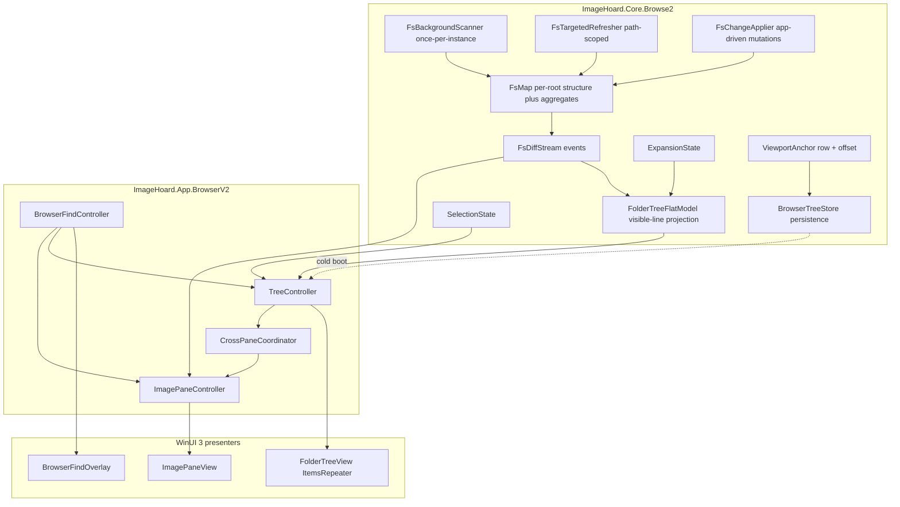

# Browser Tree Ground-Up Re-implementation

## Goals (recap)

- **G1. Accurate, fast, current FS view** — even with hundreds-to-thousands of siblings and hundreds of thousands of files; on-disk cache acceptable.
- **G2. Consistent, predictable viewport** — across navigation, mutation, and **app restarts** (selected folder, expanded set, **scroll anchor row + offset**).
- **G3. No laggy / disorienting refreshes** — every mutation is **scroll-anchored**; UI applies a single coalesced diff per dispatcher tick.

## Confirmed scope

- **Folders-only tree** with a tightly-coordinated **image pane** sibling (existing mixed semantics retire).
- **Live FS updates**: one **background full-map scan per app instance**, then **targeted refresh** on focus-gain, navigation, wizard mutations, explicit refresh, and app-driven file/folder changes. **No constant FileSystemWatcher.**
- **Recommended platform** (open for confirmation at plan approval): **WinUI 3 + custom virtualized presenter built on `ItemsRepeater`** (per accepted ADR [docs/design-decisions/browser-folder-tree-virtualization-itemsrepeater.md](docs/design-decisions/browser-folder-tree-virtualization-itemsrepeater.md)). Fallback baked into the design: a custom virtualizing tree control reusing the same Core model.

## Non-goals

- No change to **wizard internals**, **preview/decoder**, **slideshow sampling/discovery**, or **operation log**.
- No **kernel-level watching** (USN journal). No **third-party tree control**.
- No expansion to other OSes.

## Architecture overview



## Layered components

### Core (presentation-agnostic, in `ImageHoard.Core.Browse2`)

- **`FsMap`** — per-favorite-index-root persisted store of `(path, parentPath, name, mtime, hasChildren, aggregateBytes, imageCount, lastVerifiedAt)`. **Builds on existing** plan [`.cursor/plans/fs_map_disk_cache_a17d36c0.plan.md`](.cursor/plans/fs_map_disk_cache_a17d36c0.plan.md): one store per deduped favorite root, mtime-trusted, in-place resort, preflight.
- **`FsBackgroundScanner`** — one full pass per app instance after first user-visible paint; throttled (work units / dispatcher tick); writes/refreshes `FsMap`; cancellable on app exit.
- **`FsTargetedRefresher`** — re-lists a single folder + invalidates immediate children's mtime trust. Triggered by: navigate, expand, focus-gain, explicit refresh, find deep-search hit.
- **`FsChangeApplier`** — single entry point for **app-driven** mutations (rename, move, recycle, archive). Patches `FsMap` synchronously based on the operation outcome (no full re-scan needed).
- **`FsDiffStream`** — strongly-typed events (`FolderAdded`, `FolderRemoved`, `FolderRenamed`, `FolderRefreshed`, `AggregatesUpdated`). All consumers subscribe; same diffs drive both tree and image pane.
- **`FolderTreeFlatModel`** — visible-line projection: `IReadOnlyList<FolderRow>` where each row carries `Path`, `Depth`, `IsExpanded`, `HasChildren`, aggregate fields. Expand/collapse **splices** ranges (insert N rows / remove N rows). Mutations emit a single `FlatModelDelta` per tick (batched insert/remove/update spans).
- **`ExpansionState`** — `HashSet<string>` of expanded folder paths; capped (extend `BrowserTreeSnapshot.MaxExpandedFolderPaths = 64`). Persisted.
- **`SelectionState`** — currently-selected folder path. Persisted (NEW; today only `lastActedFsObject` is persisted).
- **`ViewportAnchor`** — `{ AnchorFolderPath, OffsetWithinRowPx }`. Persisted (NEW).
- **`BrowserTreeStore`** — wraps `AppSettingsStore` `paths.browserTree` block; reads/writes the four pieces above.

### App / coordination (in `ImageHoard.App.BrowserV2`)

- **`TreeController`** — orchestrator. Owns `FolderTreeFlatModel`, `ExpansionState`, `SelectionState`. Subscribes to `FsDiffStream`, computes flat-model deltas, hands them to the UI on the dispatcher.
- **`ImagePaneController`** — owns current-folder path, sort, includeSubfolders, find-scope. Subscribes to `FsDiffStream` filtered by current-folder prefix.
- **`CrossPaneCoordinator`** — replaces today's `MainWindow.BrowserPane.cs` glue. Owns: image-step → tree reveal, wizard mutation reconciliation, slideshow overlay anchoring (flat-line index + total), `lastActedFsObject` capture.
- **`BrowserFindController`** — query against `FsMap` (folder name match) or `ImagePaneController` (file match). Folder hit → `TreeController.RevealAndSelect(path)`; file hit → `ImagePaneController.SelectByPath(path)` + tree reveals parent.

### Presentation (WinUI 3)

- **`FolderTreeView`** (UserControl) — owns its own `ScrollViewer` + `ItemsRepeater` + flat row template. Custom keyboard, focus, selection, context menu, accessibility. **Scroll-anchoring discipline**: before applying any model delta, capture the topmost-realized row's path + offset; after the delta, `ChangeView` to keep that row at the same offset. Net effect: model mutations far above/below the viewport produce **zero visible scroll jumps**.
- **`ImagePaneView`** (UserControl) — initially WinUI `ListView` + `VirtualizingStackPanel` over flat image-row VMs (existing pattern works fine for a flat list).
- **`BrowserFindOverlay`** — keep existing [src/ImageHoard.App/BrowserFindPanel.xaml](src/ImageHoard.App/BrowserFindPanel.xaml) chrome, rewire backing logic to `BrowserFindController`.

## Persistence schema (extends `paths.browserTree`)

Extend [src/ImageHoard.App/AppSettingsModels.cs](src/ImageHoard.App/AppSettingsModels.cs) `BrowserTreeSettingsDto` (today: `snapshotBrowseRoot` + `expandedFolderPaths`):

```csharp
internal sealed class BrowserTreeSettingsDto
{
    public string? SnapshotBrowseRoot { get; set; }
    public List<string>? ExpandedFolderPaths { get; set; }
    public string? SelectedFolderPath { get; set; }
    public ViewportAnchorDto? ViewportAnchor { get; set; }
}

internal sealed class ViewportAnchorDto
{
    public string? AnchorFolderPath { get; set; }
    public double OffsetWithinRowPx { get; set; }
}
```

Keep `paths.lastActedFsObject` as today (action anchor for find/expand/wizard refocus, separate concern from passive viewport restore).

## Cold-boot flow (G2)

1. Load `BrowserTreeStore` from settings.
2. `TreeController` builds `FolderTreeFlatModel` from `FsMap` (no live `ListDirectory` for the whole tree — `FsMap` is hot enough).
3. Apply `ExpansionState` (splice expanded ranges into the flat model).
4. Resolve `ViewportAnchor.AnchorFolderPath` to a row index. **If found**, `ChangeView` to that row's offset. **If not found** (folder removed since last run), fall back to nearest ancestor that exists.
5. If `SelectedFolderPath` differs from `ViewportAnchor`, set selection without scrolling.
6. **Background**: `FsBackgroundScanner` starts after first paint; any divergence between `FsMap` and disk produces `FsDiffStream` events that the **scroll-anchored UI** absorbs without jumping.

## Mutation flow (G3)

For every model-mutating operation (expand, collapse, FS diff arrives, wizard mutation, sort change):

```
1. Capture viewport anchor (topmost-realized row path + pixel offset within row)
2. Compute FlatModelDelta (insert/remove/update spans)
3. Dispatch single ItemsRepeater update batch
4. After layout pass: re-resolve anchor row, ChangeView to (anchorIndex * rowHeight) + offsetWithinRow
```

This eliminates the current `LayoutUpdated`-retry pump, generation-token races, and double-scheduled viewport passes that the existing coordination doc describes ([browser-navigation-wizard-tree-coordination.md](docs/tech-design/browser-navigation-wizard-tree-coordination.md), "Races addressed").

## Find / wizard / slideshow coordination

- **Find** — `BrowserFindController` queries `FsMap` (no walking the live filesystem). Folder match: `TreeController.RevealAndSelect(path)` — auto-expands ancestors via expansion state, then scroll-anchored reveal centers the row. File match: `ImagePaneController.SelectByPath(path)` + parent reveal in tree.
- **Wizard** — wizard calls `FsChangeApplier.ApplyRecycle` / `ApplyMove` / `ApplyRename` after IO succeeds. The applier patches `FsMap` and emits diffs; tree + image pane converge automatically. No `_populateBrowserGeneration` token, no `EnterBrowserPaneMutation` depth counter — replaced by single-writer FsMap with sequential dispatcher application.
- **Slideshow overlay list position** — `CrossPaneCoordinator` exposes "current image flat index in tree-discovery order". For tree slideshow: keep existing `SlideshowDiscoveredPathStore` semantics; only the source of "where is this image in the visible browse" changes.
- **Image-step (`nav.nextImage` / `nav.prevImage`)** — drives `ImagePaneController.StepNext/Prev`; if image leaves visible image pane, scroll-anchor it; tree only re-reveals if the parent folder changed.

## Migration strategy (coexistence)

1. New code lives in `ImageHoard.Core.Browse2/` and `ImageHoard.App.BrowserV2/` namespaces.
2. New setting `ui.useBrowserV2` (default `false` during dev).
3. `MainWindow.xaml` gains a swappable host: when flag set, mount `BrowserV2Host`; else mount existing `FolderTree`.
4. Wizard / find / slideshow get adapter shims so each can call either old or new APIs based on the flag.
5. Old code (`MainWindow.BrowserPane.cs` ~5,000 lines, `MainWindow.BrowserViewport.cs`, `MainWindow.BrowserFind.cs`, `MainWindow.BrowserTreeDelete.cs`, `BrowserTreeItemTemplateSelector.cs`, `FolderTreeEntry.cs`, `ImageRow.cs` tree-row uses, related templates in `MainWindow.xaml`) deletes once parity is achieved and flag flips on by default.

## Documentation

New / updated ADRs:

- **NEW** [docs/design-decisions/browser-tree-rewrite-architecture.md](docs/design-decisions/browser-tree-rewrite-architecture.md) — three-layer model, scroll-anchoring contract, FsDiffStream API.
- **NEW** [docs/design-decisions/browser-tree-viewport-anchor-persistence.md](docs/design-decisions/browser-tree-viewport-anchor-persistence.md) — viewport anchor schema + cold-boot algorithm.
- **UPDATE** [docs/design-decisions/browser-folder-tree-virtualization-itemsrepeater.md](docs/design-decisions/browser-folder-tree-virtualization-itemsrepeater.md) — record implementation notes; remove "Phase 1 spike" wording.
- **SUPERSEDE** [docs/design-decisions/browser-folder-tree-path-to-node-index.md](docs/design-decisions/browser-folder-tree-path-to-node-index.md) — `_folderTreeNodeByPath` no longer applies; replaced by `FolderTreeFlatModel.RowIndexByPath`.
- **UPDATE** [docs/tech-design/browser-navigation-wizard-tree-coordination.md](docs/tech-design/browser-navigation-wizard-tree-coordination.md) — `_populateBrowserGeneration`, viewport pump, mutation depth all collapse into the new model; document the diff-stream flow.
- **UPDATE** PRD traceability for **FR-BR-01..07**, **NFR-PF-05/06**.

## Tests

Pure-core (xUnit, no UI):

- `FolderTreeFlatModelTests` — splice on expand/collapse, ranges contiguous, indices stable, idempotent re-apply.
- `FsDiffStreamTests` — folder add/remove/rename produces correct deltas under expansion state.
- `ViewportAnchorRestoreTests` — anchor resolves; missing anchor falls back to ancestor; anchor inside collapsed subtree resolves to nearest visible ancestor.
- `FsBackgroundScannerTests` — throttled, cancellable, idempotent, no double-scan of the same root.
- `FsChangeApplierTests` — patches FsMap correctly for rename, move, recycle (single-folder + recursive).
- `BrowserFindControllerTests` — folder + file matches drive correct controller calls.

Integration (existing test stack):

- `TreeControllerScrollAnchorTests` — given a sequence of mutations, the captured anchor row stays at the same pixel offset (uses fake `IScrollHost`).
- Port relevant tests from existing suite (e.g. `BrowserTreeViewportIntentResolverTests`, `BrowserTreeSnapshotTests`) where they encode user-facing behavior we must preserve.

UI smoke (manual until automated):

- 100k-folder synthetic tree: open, expand random branches, collapse, observe **no** visible scroll jumps; cold-boot lands at saved anchor.

## Open decisions for plan approval

1. **Platform direction** — confirm WinUI 3 + `ItemsRepeater`-backed custom virtualizing tree (recommended) vs swap UI framework for the browser pane vs other.
2. **Image pane separation** — confirm the UX shift (folders-only tree + sibling image pane) is acceptable to ship; image pane gets its own column in `MainWindow.xaml` layout.
3. **Migration flag lifetime** — keep `ui.useBrowserV2` until manual QA passes on real archives, then remove. Estimated dev time: large; not estimated here.