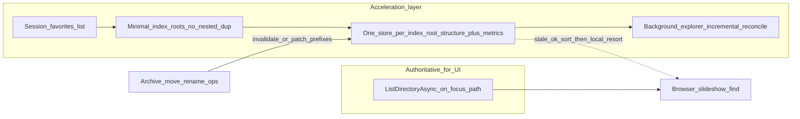

# Recommendation: disk-backed filesystem map for favorited trees

## Scope: favorites only, nested favorites without duplication

**Persisted maps are built only for paths in the user’s favorites list** (today [`_session.Favorites`](src/ImageHoard.App/MainWindow.P0.cs) / [`AppSettingsModels` session favorites](src/ImageHoard.App/AppSettingsModels.cs)); arbitrary browsed folders outside that set do not get a durable map unless promoted to a favorite.

**Nested favorites are expected** (e.g. favoriting `…\Archive` for general browsing or a huge tree slideshow, and also `…\Archive\Projects\Foo` for a scoped slideshow). **Do not store two copies of the same subtree.**

**Index roots (deduplication rule):** After normalizing paths (full path, trim trailing separators, `StringComparer.OrdinalIgnoreCase` consistent with favorites):

1. Sort favorites (e.g. by length, then ordinal).
2. An **index root** is any favorite path **not** strictly under another favorite (proper prefix + directory boundary: `C:\Archive` is an ancestor of `C:\Archive\Foo`, not of `C:\ArchiveOld`).
3. Persist **one map file (or one logical store partition) per index root** only.
4. A **nested favorite** (descendant of another favorite) **reuses** the ancestor’s map; slideshow/find “from this favorite” is a **subtree view** (prefix filter + same invalidation lineage), not a second full scan artifact on disk.

If no favorite is an ancestor of another (disjoint trees), you naturally get **one map per favorite**—no unnecessary merge.

Edge cases to spell out in implementation:

- **Removing the outer favorite** while keeping an inner one: the inner path becomes a new index root; **rename or merge** on-disk store (or rebuild from inner root on next background pass) so storage stays single-owner per path prefix.
- **Reordering adds**: adding an outer favorite later subsumes inner maps—**stop maintaining** the inner-only store (delete or orphan) and attach inner paths to the outer index.

## Verdict

**Yes for performance** (large archives, cold starts, sort-by-size without blocking first paint) **if** the cache is explicitly **secondary** for **names and cwd listing**: it carries **warm metrics + structure** for favorited subtrees—it never replaces the live listing for the directory the UI is showing.

**Stability is mixed**: batched merges and preflight reduce UI jank and exception noise; **incorrect invalidation** still risks wrong order until reconcile. **Stale-first sort** is an explicit trade: acceptable if convergence is reliable and **in-place resort** does not disorient the user.

## What the codebase already does (relevant precedent)

- **Live listings** for browser population come from [`IFileSystem.ListDirectoryAsync`](src/ImageHoard.App/MainWindow.BrowserPane.cs) (no persistent “full tree” cache for names).
- **Persisted subtree work** already exists for **aggregates** via [`FolderMetricsCacheStore`](src/ImageHoard.Core/Metrics/FolderMetricsCacheStore.cs) (JSONL, FR-BR-07) with **mtime-based trust** and UI-throttled background draining (`EnqueueFolderMetricsDiscovery`, `ProcessFolderMetricsDiscoveryQueueTick` in the same browser pane partial). The design doc [`docs/design-decisions/folder-aggregate-metrics-model.md`](docs/design-decisions/folder-aggregate-metrics-model.md) already describes **fine invalidation on navigate** and even the split between **trusted subtree counts** vs **immediate-child expand signals** (see “collapsed folder totals vs expand chevron”).
- **Slideshow** uses session enumeration + optional temp spill in [`SlideshowDiscoveredPathStore`](src/ImageHoard.Core/Slideshow/SlideshowDiscoveredPathStore.cs), not a durable cross-session index.

So you are not starting from zero: the product already accepts **“cache expensive subtree facts, but reconcile with cheap directory metadata.”** The revised direction treats the **filesystem map and folder metrics as one logical store** (not a separate JSONL silo plus an unrelated tree index): each indexed directory carries **child listing fingerprints and/or aggregate fields** needed for [`FolderDirectorySort`](src/ImageHoard.App/MainWindow.BrowserPane.cs) when sort mode is size- or count-based.

## Folder metrics inside the map (sorting large sibling lists)

- **Goal:** When a parent has **hundreds or thousands of subfolders**, sorting by aggregate size or image count should not require a full synchronous subtree scan before first paint.
- **Acceptable UX:** **Initial order and column values may come from the last persisted map** (stale). Label or internal state may treat values as **provisional** until reconciled; no claim that they match disk to the byte until verified.
- **Convergence:** As the user **opens** branches or as the **background explorer** visits nodes, compare **directory mtime** (and/or shallow listing hash) to the map row; on mismatch, **recompute that subtree slice**, **append/patch** the persisted map, and enqueue a **small UI delta**—same spirit as `EnqueueFolderMetricsSnapshotForUiApply` + `ProcessPendingFolderMetricsSnapshotsBatched` (chunked applies, not one giant UI pass).

Consolidating metrics into the map avoids **double DFS** (one for “map” and one for FR-BR-07) over the same favorited subtrees; the legacy [`FolderMetricsCacheStore`](src/ImageHoard.Core/Metrics/FolderMetricsCacheStore.cs) path can remain for migration/backfill or be folded behind one API over time (engineering choice documented in ADR).

## UI responsiveness: keep batch processing (do not regress)

Retain and extend patterns already tuned in [`MainWindow.BrowserPane.cs`](src/ImageHoard.App/MainWindow.BrowserPane.cs):

- **Staged folder populate** for large directories (`ShouldStagedBrowserPopulate`, `AppendBrowserStagedToTargetAsync`, `BrowserFolderUiChunkSize` + `Task.Yield` between chunks).
- **Folder metrics:** bounded drain per dispatcher tick (`BrowserMetricsDiscoveryDrainPerTick`, post-navigate “settling” lower cap), **coalesced pending snapshot queue** with `BrowserMetricsSnapshotApplyChunkSize` / `BrowserMetricsSnapshotApplyMaxChunksPerDispatcherCallback`.
- **Cancellation / generation guards:** `_populateBrowserGeneration` (and related gens) so stale async results never repopulate after navigate.

Background map exploration should use the **same class of limits** (work units per tick, cooperative cancel), extended to “walk next unverified node” from the persisted map.

## Viewport-stable resort (keep browsed folder visible; no surprise snaps)

**Intended behavior:** After metrics-driven **resort of the current sibling list**, the user’s **browsed folder** (the folder that is the current browse target / “you are here”) **remains visible** in the folder tree viewport. They should still recognize where they are in the hierarchy.

**Undesired behavior:** The tree **scroll position jumps** to an **unrelated** region (for example top of a root, first row after sort, or a previously focused node) **without user input**, so the browsed folder is **off-screen** or the tree **looks like a different place**—the user feels **lost**.

**Implementation notes:**

- **Reorder** `TreeViewNode` / flat projection rows **in place** for that sibling collection only (same parent, new order). **Do not** change `_currentFolderPath` and **do not** re-run a full tree populate solely to resort.
- **Scroll / viewport:** Avoid **wholesale** scroll resets or implicit “scroll into” arbitrary nodes. If reorder moves the browsed row’s index, a **minimal, predictable** adjustment to keep that **same row** visible is acceptable (re-anchor on the browsed path), which is **not** the same as an arbitrary snap.
- If resort today triggers full repopulate, refactor so **sort mutation is a local list operation** gated on “same parent path + same populate generation,” then apply the visibility rule above.

This is a concrete NFR alongside FR-BR sort modes.

## Preflight: skip work for missing or obsolete targets

Before starting `ListDirectoryAsync`, image row creation, metrics jobs, or background children for a queued path:

- Verify **`populateBrowserGeneration` / navigation generation** still matches the job’s token (existing pattern; extend to map walker).
- **Cheap existence check** (e.g. `Directory.Exists` / `File.Exists` or `IFileSystem` equivalent) for the target path; if missing, **drop the work item** and optionally prune the map row or mark stale—avoid throwing-driven UI status spam for paths the user already left behind.

This reduces wasted I/O and race noise when favorites point at removed drives or rapid navigation outpaces queued discovery.

## Where disk caching helps most (aligned with your usage)

- **A small set of index roots** (often 2–5 after deduping nested favorites) with **large, slowly changing** subtrees: amortize discovery across sessions (slideshow warm-up, global find, prefetch of sibling branch metadata).
- **Distant branches** the user has not opened: safe to treat as **eventually consistent** if the UI never presents them as guaranteed-current without a “refreshing…” affordance or silent reconcile.

## Where it hurts (mitigations)

- **Moves between download and archive via the app**: directory **mtimes are an incomplete signal** (moves, some tools, and NAS semantics can leave you with trusted-but-wrong rows). Mitigation: on **successful operations** that the app already knows about (archive wizard, rename/move pipelines), **invalidate or patch** the persisted map for affected path prefixes on both source and destination roots—this should align with the operation-log direction in [`docs/design-decisions/operation-log-fr-sr-09.md`](docs/design-decisions/operation-log-fr-sr-09.md) (event-sourced invalidation is more reliable than heuristics alone).
- **External mutators** (Explorer, sync clients): rely on **mtime + periodic reconcile + manual “clear cache”** (FR-ST-03 in the metrics doc) until/unless you adopt something stronger (e.g. USN Journal on Windows—significant scope).

## Suggested architecture (conceptual)

- **Load on startup**: hydrate from disk **only for computed index roots** (deduped favorites); **do not** skip `ListDirectoryAsync` for the restored browse path.
- **Navigate**: always **refresh the opened folder** from disk (your stated requirement); **seed** sort keys from map; **merge** incremental corrections via batched UI updates.
- **Background**: incremental reconciliation (same throttling/cancellation as metrics discovery); cap concurrency; cancel on browse generation changes (`_populateBrowserGeneration` pattern already used throughout [`MainWindow.BrowserPane.cs`](src/ImageHoard.App/MainWindow.BrowserPane.cs)).

## Documentation / traceability

Any durable map should be treated as **cache policy**, not silent truth: update [`folder-aggregate-metrics-model.md`](docs/design-decisions/folder-aggregate-metrics-model.md) or add a focused ADR (e.g. “filesystem index + metrics cache”) so FR/NFR claims stay traceable—especially **FR-BR-06/07** (aggregates + persistence), **FR-BR-03** (stable sort with tie-break), **NFR-PF-05** (non-blocking UI), plus new explicit **viewport-stable resort** (browsed folder stays visible; no arbitrary tree scroll snaps) and **stale-first display** semantics.

## Bottom line

**Recommendation: proceed conceptually**—one persisted **structure + metrics** store per **deduped index root** (nested favorites share storage), **stale-first sort** with **incremental** correction via browse + background walks, **batched UI merges**, **in-place resort** without viewport or browse-target churn, and **preflight** checks so async work does not hammer missing paths. **Invalidation remains first-class** for in-app moves between trees; without that, stale metrics will occasionally mis-order until reconcile.
