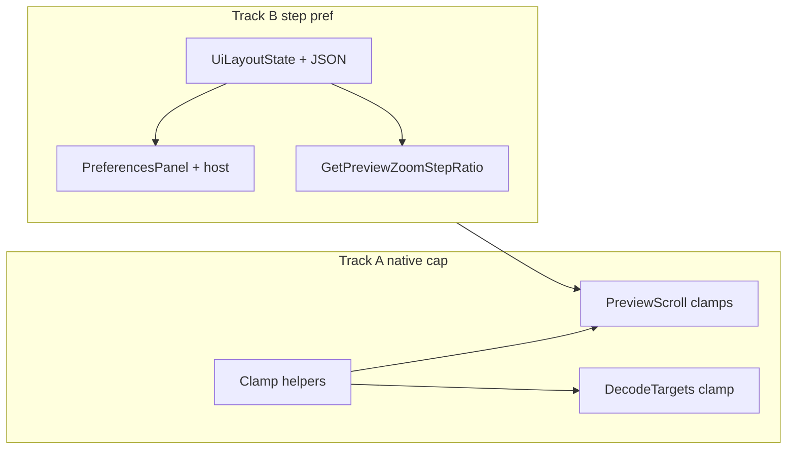

# Integrated plan: preview zoom max (native) + zoom step preference

This is the **in-repo** copy (same content as the user-level Cursor plan). It combines the **zoom step preference** work and **native-relative `PreviewZoomMaxFactor`** work into one implementation sequence.

## Goals

| Track | Goal |
|-------|------|
| **A. Native-relative max** | `PreviewZoomMaxFactor` caps **displayed** width/height vs **oriented file native** logical DIPs (`dispW ≤ M·nativeW`, etc.), not a raw cap on `z` vs fit baseline. Fixes unreachable 1:1 when `1/s > M` and aligns **Original file resolution** with that semantics. |
| **B. Zoom step preference** | Persist **`previewZoomStepRatio`** (default `1.1`), Advanced → Preview **NumberBox**, drive zoom in/out instead of a const. |

Both touch [`MainWindow.PreviewScroll.cs`](src/ImageHoard.App/MainWindow.PreviewScroll.cs); no semantic conflict: step ratio multiplies/divides `z`; native-relative logic clamps `z` into `[zMin, zMax]`.

## Recommended implementation order

1. **Track A (native-relative clamp)** first — behavior fix + [`MainWindow.DecodeTargets.cs`](src/ImageHoard.App/MainWindow.DecodeTargets.cs); establishes `TryGetPreviewUserZoomClampRange` and all clamp call sites.
2. **Track B (step preference)** second — adds [`AppSettingsModels`](src/ImageHoard.App/AppSettingsModels.cs) / [`AppSettingsStore`](src/ImageHoard.App/AppSettingsStore.cs) / [`IPreferencesSession`](src/ImageHoard.App/IPreferencesSession.cs) / [`MainWindow.PreferencesHost`](src/ImageHoard.App/MainWindow.PreferencesHost.cs) / [`PreferencesPanel`](src/ImageHoard.App/PreferencesPanel.xaml) and replaces **`PreviewZoomStepRatio`** const with `_layoutState`-backed helper inside the same partial.

## Track A — Native-relative `PreviewZoomMaxFactor` (summary)

- **Problem:** Fixed `Math.Clamp(z, 0.1, 10)` limits `z` as a multiple of **fit baseline**, blocking true native 1:1 when baseline is tiny vs native.
- **Semantics:** `zMax = PreviewZoomMaxFactor * min(nativeW/baseW, nativeH/baseH)` using oriented pixels → DIPs when available ([`RememberPreviewOrientedPixelSize`](src/ImageHoard.App/MainWindow.PreviewScroll.cs) / decode path); fallback intrinsic matches [`TryGetPreviewImageIntrinsicDips`](src/ImageHoard.App/MainWindow.PreviewScroll.cs). Baselines from existing `ComputeImageDisplayBaselineDipsWindowed` / `Fullscreen`.
- **Two hosts:** `_previewUserZoomFactor` is shared; use **`zMax = min(zMaxPreview, zMaxFullscreen)`** when both viewports resolve ([`UpdatePreviewScrollMetrics`](src/ImageHoard.App/MainWindow.PreviewScroll.cs), [`ApplyFullscreenImageForFitMode`](src/ImageHoard.App/MainWindow.PreviewScroll.cs)).
- **Minimum:** Keep **`PreviewZoomMinFactor`** as absolute floor on `z` (out of scope: native-relative min).
- **Re-clamp:** At start of **`UpdatePreviewScrollMetrics`**, clamp stored `z` into current `[zMin, zMax]` after resize/host switch.
- **Zoom in/out:** When clamping after step, use dynamic range; host selection: **`_isFullscreen` ? fullscreen : preview** with fallback if viewport invalid.
- **Decode:** [`CreateWicDecodeLayout`](src/ImageHoard.App/MainWindow.DecodeTargets.cs) — clamp `z` with preview viewport’s **`zMax`** (same as decode target host).
- **Docs in code:** XML on `PreviewZoomMaxFactor` / fullscreen zoom comment — state **max display vs oriented native logical size**.

## Track B — Advanced `previewZoomStepRatio` (summary)

- **Models:** [`UiSettingsSection`](src/ImageHoard.App/AppSettingsModels.cs) + [`UiLayoutState`](src/ImageHoard.App/AppSettingsModels.cs): `PreviewZoomStepRatio`, JSON `previewZoomStepRatio`, default `1.1`.
- **Persistence:** [`AppSettingsStore`](src/ImageHoard.App/AppSettingsStore.cs) `MapToLayoutState` + `SaveAll`; validate finite and e.g. **`1.01`…`2.0`** on load/apply (mirror existing preview doubles).
- **Preferences:** [`IPreferencesSession`](src/ImageHoard.App/IPreferencesSession.cs) getter + `ApplyPreviewZoomStepRatio`; [`MainWindow.PreferencesHost`](src/ImageHoard.App/MainWindow.PreferencesHost.cs) → `PersistLayout()`; [`PreferencesPanel.xaml`](src/ImageHoard.App/PreferencesPanel.xaml) + [`.xaml.cs`](src/ImageHoard.App/PreferencesPanel.xaml.cs) under Advanced → Preview (after existing preview tuning controls): **NumberBox** + short helper text (~10% per step at `1.1`).
- **Runtime:** Remove const `PreviewZoomStepRatio`; `GetPreviewZoomStepRatio()` → `Math.Clamp(_layoutState.PreviewZoomStepRatio, 1.01, 2.0)` (or shared private constants); use in **`TryExecuteViewZoomIn` / `Out`**.

## Verification (combined)

- Per [`AGENTS.md`](AGENTS.md): ensure **`ImageHoard.App`** is not running before `dotnet build` / `dotnet test`.
- **A:** Very large image, small preview — zoom in + **Original file resolution** reaches **native 1:1** with `PreviewZoomMaxFactor = 10`; zoom further until growth stops at **`M × native`**; resize window re-clamps.
- **B:** Change step in Advanced; zoom in/out step size changes; **`settings.json`** contains `previewZoomStepRatio`; survives restart.

## Optional follow-ups

- Note new `ui.previewZoomStepRatio` in [`docs/design-decisions/fr-st-01-settings-persistence.md`](docs/design-decisions/fr-st-01-settings-persistence.md) if you document every key.
- User-editable **`PreviewZoomMaxFactor`** (still const in these plans).
- xUnit pure-math tests for **`zMax`** formula in Core (optional).

## Dependency diagram

`GetPreviewZoomStepRatio` reads `_layoutState` on `MainWindow`; native clamp helpers live on the same partial — implement A’s helpers before B’s `TryExecuteViewZoomIn` uses both dynamic `zMax` and `GetPreviewZoomStepRatio`.
